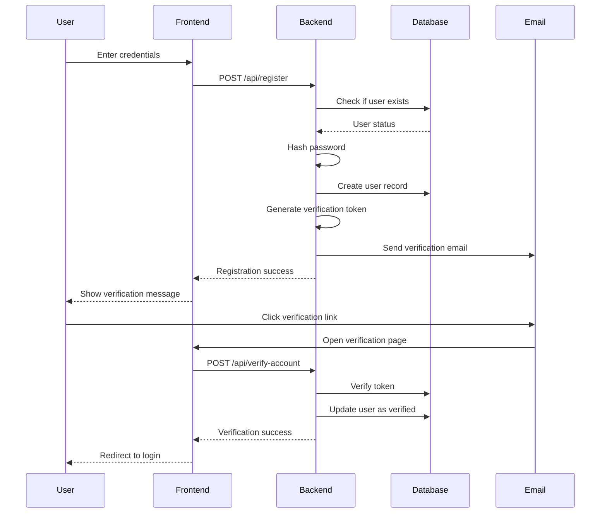
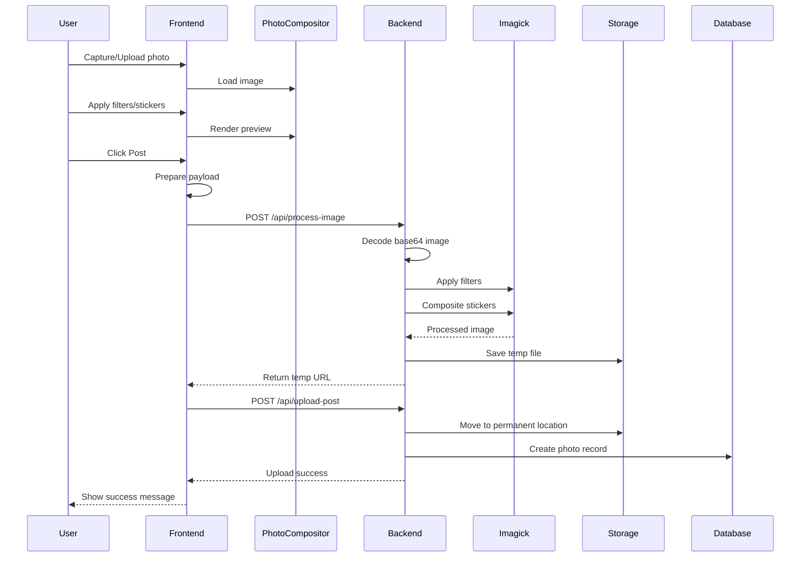
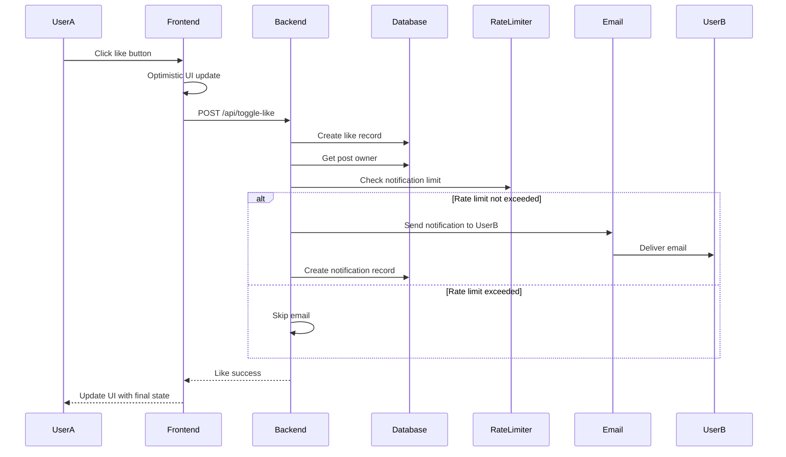
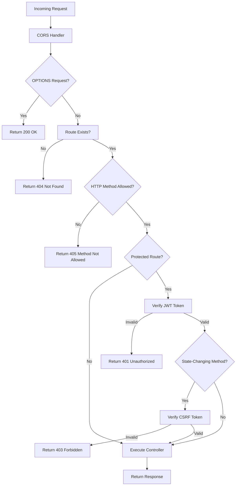
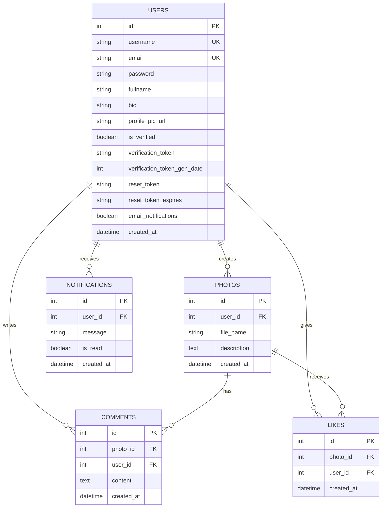
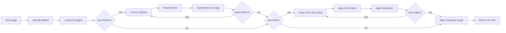
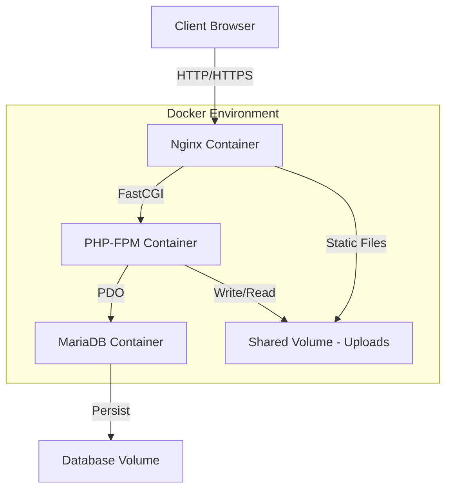

# Camagru

## Introduction

Camagru is a web-based photo-sharing application that allows users to create, edit, and share photos with integrated camera support and image manipulation capabilities. The platform enables users to capture photos using their webcam, apply filters, add custom stickers, and share their creations with a community of users who can like and comment on posts.

### Core Purpose

The application serves as a social photo-sharing platform similar to Instagram based on 42's subject, Camagru, with a focus on creative photo editing and real-time interaction. Users can build their profiles, follow their creative process through saved drafts, and engage with other users through comments and likes.

### Key Features

- User authentication with email verification
- Real-time photo capture via webcam
- Image upload and editing capabilities
- Server-side image processing with filters and stickers
- Social interaction through likes and comments
- User profiles with customizable settings
- Email notifications for user engagement
- Responsive design for mobile and desktop

## Frontend Features

### User Authentication and Account Management

| Feature            | Description                                           | Implementation                                                   |
| ------------------ | ----------------------------------------------------- | ---------------------------------------------------------------- |
| Registration       | User sign-up with email verification                  | Form validation, password hashing, verification token generation |
| Login              | JWT-based authentication                              | Token storage in localStorage, automatic session management      |
| Email Verification | Account activation via email link                     | Token-based verification system with expiration                  |
| Password Recovery  | Reset password via email                              | Secure token generation with time-based expiration               |
| Account Settings   | Update profile information, password, and preferences | Form validation, avatar upload, notification preferences         |

### Photo Creation and Editing

| Feature          | Description                     | Implementation                                        |
| ---------------- | ------------------------------- | ----------------------------------------------------- |
| Camera Capture   | Real-time webcam access         | MediaDevices API with 720p resolution support         |
| Image Upload     | Upload existing photos          | File input with type validation                       |
| Filter System    | Apply visual effects to photos  | CSS filters for preview, Imagick for final processing |
| Custom Stickers  | Add and position image overlays | Drag-and-drop interface with scaling and rotation     |
| Draft Management | Save work in progress           | localStorage-based storage with capacity management   |
| Canvas Preview   | Real-time editing visualization | HTML5 Canvas API for rendering                        |

Available filters include Normal, Black & White, Sepia, Vintage, Bright, Cool, Warm, and Contrast variations.

### Social Interaction

| Feature       | Description                     | Implementation                                     |
| ------------- | ------------------------------- | -------------------------------------------------- |
| Post Feed     | Browse photos from all users    | Infinite scroll with cursor-based pagination       |
| User Profiles | View user posts and information | Dynamic routing with user-specific data loading    |
| Likes         | Toggle like on posts            | Optimistic UI updates with backend synchronization |
| Comments      | Add and delete comments         | Real-time comment rendering with XSS protection    |
| User Search   | Find users by username          | Debounced search with autocomplete                 |
| Post Sharing  | Share post links                | Copy-to-clipboard functionality                    |

### User Interface Components

| Component           | Purpose            | Features                                              |
| ------------------- | ------------------ | ----------------------------------------------------- |
| Sidebar             | Desktop navigation | Route navigation, user profile access, photo creation |
| Mobile Bottom Bar   | Mobile navigation  | Touch-optimized navigation for mobile devices         |
| Modal System        | Overlay content    | Post viewing, photo editing, user search              |
| Toast Notifications | User feedback      | Success, error, and info messages                     |
| Tooltips            | Contextual help    | Hover-based information display                       |

## Backend Features

### Authentication and Authorization

| Feature            | Description                        | Security Measures                                      |
| ------------------ | ---------------------------------- | ------------------------------------------------------ |
| JWT Authentication | Stateless user sessions            | HS256 signing, token expiration, secret key protection |
| CSRF Protection    | Prevent cross-site request forgery | Synchronizer token pattern with session validation     |
| Password Security  | Secure password storage            | Bcrypt hashing with automatic salt generation          |
| Rate Limiting      | Prevent brute force attacks        | File-based rate limiter with configurable limits       |
| Email Verification | Confirm user identity              | Time-limited verification tokens                       |

### API Endpoints

| Endpoint                      | Method | Purpose                             | Authentication Required |
| ----------------------------- | ------ | ----------------------------------- | ----------------------- |
| `/api/register`               | POST   | Create new user account             | No                      |
| `/api/login`                  | POST   | Authenticate user                   | No                      |
| `/api/verify-account`         | POST   | Verify email address                | No                      |
| `/api/password-recovery`      | POST   | Request password reset              | No                      |
| `/api/reset-password`         | POST   | Reset user password                 | No                      |
| `/api/csrf`                   | GET    | Get CSRF token                      | No                      |
| `/api/user`                   | GET    | Get current user data               | Yes                     |
| `/api/photos`                 | GET    | Get user photos                     | Yes                     |
| `/api/photo`                  | GET    | Get single photo details            | Yes                     |
| `/api/feed`                   | GET    | Get photo feed                      | Yes                     |
| `/api/process-image`          | POST   | Process image with filters/stickers | Yes                     |
| `/api/upload-post`            | POST   | Upload final post                   | Yes                     |
| `/api/delete-post`            | DELETE | Delete user post                    | Yes                     |
| `/api/create-comment`         | POST   | Add comment to post                 | Yes                     |
| `/api/delete-comment`         | DELETE | Remove comment                      | Yes                     |
| `/api/toggle-like`            | POST   | Like or unlike post                 | Yes                     |
| `/api/update-account`         | POST   | Update user settings                | Yes                     |
| `/api/delete-account`         | DELETE | Delete user account                 | Yes                     |
| `/api/upload-profile-picture` | POST   | Update profile avatar               | Yes                     |
| `/api/search-users`           | GET    | Search for users                    | Yes                     |
| `/api/user-profile`           | GET    | Get user profile data               | Yes                     |

### Image Processing

The backend uses PHP's Imagick extension for high-quality image manipulation.

| Operation           | Implementation                 | Purpose                                        |
| ------------------- | ------------------------------ | ---------------------------------------------- |
| Filter Application  | Color matrix transformations   | Apply sepia, grayscale, brightness adjustments |
| Sticker Composition | Image overlay compositing      | Merge custom stickers onto base image          |
| Image Resizing      | Automatic dimension adjustment | Prevent oversized uploads, optimize storage    |
| Format Validation   | MIME type verification         | Ensure only valid image files are processed    |
| Base64 Decoding     | Data URL processing            | Handle frontend canvas exports                 |

### Database Models

| Model        | Purpose                                  | Key Relationships                               |
| ------------ | ---------------------------------------- | ----------------------------------------------- |
| User         | Store user accounts and profiles         | Has many Photos, Comments, Likes, Notifications |
| Photo        | Store photo metadata and file references | Belongs to User, has many Comments, Likes       |
| Comment      | Store user comments on photos            | Belongs to User and Photo                       |
| Like         | Track photo likes                        | Belongs to User and Photo, unique constraint    |
| Notification | Store user notifications                 | Belongs to User                                 |

### Middleware and Security

| Component         | Function                     | Implementation                                 |
| ----------------- | ---------------------------- | ---------------------------------------------- |
| CORS Handler      | Enable cross-origin requests | Configurable origins, methods, and headers     |
| Request Validator | Validate input data          | Type checking, sanitization, XSS prevention    |
| Route Guard       | Protect authenticated routes | JWT verification before controller execution   |
| Rate Limiter      | Throttle requests            | File-based storage with TTL support            |
| CSRF Validator    | Verify request authenticity  | Token comparison for state-changing operations |

### Email System

| Feature              | Purpose                  | Implementation                                      |
| -------------------- | ------------------------ | --------------------------------------------------- |
| Verification Emails  | Confirm new accounts     | HTML template with activation link                  |
| Password Reset       | Secure password recovery | Time-limited reset token in email                   |
| Notification Emails  | Inform users of activity | Optional email notifications for likes and comments |
| Rate-Limited Sending | Prevent email spam       | Throttle notifications per user/post                |

## System Architecture Diagrams

### User Authentication Flow



### Photo Upload and Processing Flow



### Like and Comment Notification Flow



### Request Middleware Pipeline



### Database Schema Relationships



### Image Processing Architecture



## Technology Stack

### Frontend Technologies

| Technology         | Version | Purpose                                |
| ------------------ | ------- | -------------------------------------- |
| HTML5              | -       | Semantic markup and structure          |
| CSS3               | -       | Styling and responsive design          |
| Vanilla JavaScript | ES6+    | Application logic and DOM manipulation |
| Canvas API         | -       | Image rendering and manipulation       |
| MediaDevices API   | -       | Webcam access for photo capture        |
| LocalStorage API   | -       | Draft and session management           |

### Frontend Architecture

| Pattern                 | Implementation                                        |
| ----------------------- | ----------------------------------------------------- |
| Single Page Application | Client-side routing with history API                  |
| Component-Based         | Modular, reusable UI components                       |
| State Management        | Local state with manual synchronization               |
| Event-Driven            | Custom event system for inter-component communication |

### Backend Technologies

| Technology        | Version | Purpose                        |
| ----------------- | ------- | ------------------------------ |
| PHP               | 8.0+    | Server-side application logic  |
| MariaDB           | Latest  | Relational database management |
| Imagick Extension | -       | Advanced image processing      |
| GD Extension      | -       | Fallback image processing      |
| PDO               | -       | Database abstraction layer     |

### Backend Architecture

| Pattern              | Implementation                         |
| -------------------- | -------------------------------------- |
| MVC Architecture     | Model-View-Controller separation       |
| RESTful API          | Resource-based endpoint design         |
| Middleware Pattern   | Request interception and processing    |
| Repository Pattern   | Abstract database operations in models |
| Dependency Injection | Manual injection in controllers        |

### DevOps and Deployment

| Technology     | Purpose                       |
| -------------- | ----------------------------- |
| Docker         | Containerization of services  |
| Docker Compose | Multi-container orchestration |
| Nginx          | Web server and reverse proxy  |
| PHP-FPM        | FastCGI process manager       |
| Git            | Version control               |

### Development and Testing

| Tool              | Purpose                      |
| ----------------- | ---------------------------- |
| Cypress           | End-to-end testing framework |
| Browser DevTools  | Frontend debugging           |
| PHP Error Logging | Backend debugging            |

### Infrastructure Components



### File Structure

```
Camagru/
├── src/
│   ├── frontend/
│   │   ├── Main.js                 # Application entry point
│   │   ├── index.html              # HTML template
│   │   ├── style.css               # Global styles
│   │   ├── js/
│   │   │   ├── Router.js           # Client-side routing
│   │   │   └── RouterHistory.js    # History management
│   │   ├── pages/
│   │   │   ├── Home.js             # Feed page
│   │   │   ├── Profile.js          # User profile
│   │   │   ├── PostPage.js         # Single post view
│   │   │   ├── EditorPage.js       # Photo editor
│   │   │   ├── Login.js            # Authentication
│   │   │   ├── Register.js         # Registration
│   │   │   └── Settings.js         # User settings
│   │   ├── components/
│   │   │   ├── Sidebar.js          # Desktop navigation
│   │   │   ├── MobileBottomBar.js  # Mobile navigation
│   │   │   ├── Post.js             # Post card component
│   │   │   ├── Modal/              # Modal components
│   │   │   └── post-modal/         # Post detail components
│   │   └── utils/
│   │       ├── PhotoCompositor.js  # Canvas utilities
│   │       └── DraftStorage.js     # LocalStorage manager
│   └── backend/
│       ├── index.php               # API router
│       ├── Core/
│       │   ├── init.php            # Bootstrap file
│       │   ├── Config.php          # Configuration
│       │   ├── Database.php        # Database connection
│       │   ├── AbstractModel.php   # Base model class
│       │   ├── Middleware.php      # Request middleware
│       │   ├── Jwt.php             # JWT utilities
│       │   ├── Csrf.php            # CSRF protection
│       │   ├── Cors.php            # CORS handler
│       │   ├── RateLimiter.php     # Rate limiting
│       │   ├── Validator.php       # Input validation
│       │   ├── Utils.php           # Image processing
│       │   ├── Request.php         # HTTP request wrapper
│       │   ├── HttpResponse.php    # HTTP response wrapper
│       │   ├── MailVerification.php # Email verification
│       │   ├── NotificationMailer.php # Email notifications
│       │   └── MigrationManager.php # Database migrations
│       ├── Controllers/
│       │   ├── AuthController.php  # Authentication logic
│       │   ├── MediaController.php # Photo operations
│       │   ├── CommentController.php # Comment operations
│       │   ├── LikeController.php  # Like operations
│       │   └── SettingsController.php # User settings
│       ├── Models/
│       │   ├── User.php            # User model
│       │   ├── Photo.php           # Photo model
│       │   ├── Comment.php         # Comment model
│       │   ├── Like.php            # Like model
│       │   └── Notification.php    # Notification model
│       └── migrations/             # Database migrations
├── docker/
│   ├── frontend/
│   │   ├── Dockerfile              # Frontend container config
│   │   └── nginx.conf              # Nginx configuration
│   ├── backend/
│   │   └── Dockerfile              # Backend container config
│   └── db/
│       └── init.sql                # Database schema
├── cypress/
│   └── e2e/                        # End-to-end tests
├── docs/                           # Technical documentation
├── docker-compose.yml              # Container orchestration
└── .env                            # Environment variables
```

## Security Measures

### Input Validation and Sanitization

| Layer    | Measures                                           |
| -------- | -------------------------------------------------- |
| Frontend | Form validation, type checking, character limits   |
| Backend  | Type hints, regex validation, HTML entity encoding |
| Database | Prepared statements, parameterized queries         |

### Authentication Security

| Feature            | Implementation                                 |
| ------------------ | ---------------------------------------------- |
| Password Hashing   | Bcrypt with automatic salt generation          |
| JWT Tokens         | HS256 algorithm with secret key signing        |
| Token Expiration   | Configurable expiration time                   |
| Session Management | Stateless authentication with token validation |

### Attack Prevention

| Attack Type   | Prevention Method                                  |
| ------------- | -------------------------------------------------- |
| SQL Injection | PDO prepared statements with bound parameters      |
| XSS           | HTML entity encoding on all user input             |
| CSRF          | Synchronizer token pattern with session validation |
| Brute Force   | Rate limiting on authentication endpoints          |
| File Upload   | MIME type validation, size limits, secure storage  |

### Data Protection

| Measure              | Implementation                                |
| -------------------- | --------------------------------------------- |
| HTTPS Support        | Nginx SSL configuration ready                 |
| Secure Headers       | CORS headers, content type validation         |
| Database Credentials | Environment variables, not in code            |
| JWT Secret           | Environment variable with strong random value |
| Email Tokens         | Time-limited, one-time use tokens             |

## Performance Optimizations

### Frontend Optimizations

| Technique               | Benefit                             |
| ----------------------- | ----------------------------------- |
| Cursor-Based Pagination | Efficient loading of large datasets |
| Lazy Loading            | Load images only when needed        |
| LocalStorage Caching    | Reduce server requests for drafts   |
| Optimistic UI Updates   | Immediate user feedback             |
| Debounced Search        | Reduce API calls during typing      |

### Backend Optimizations

| Technique          | Benefit                               |
| ------------------ | ------------------------------------- |
| Database Indexing  | Fast query execution on users, photos |
| Connection Pooling | Reuse database connections            |
| Rate Limiting      | Prevent resource exhaustion           |
| File-Based Caching | Quick access to frequently used data  |
| Efficient Queries  | Select only needed columns, use joins |

### Image Processing Optimizations

| Technique              | Benefit                             |
| ---------------------- | ----------------------------------- |
| Automatic Resizing     | Prevent oversized uploads           |
| Server-Side Processing | Offload work from client            |
| Temporary Files        | Process images before final storage |
| Format Optimization    | Use appropriate image formats       |

## Configuration

### Environment Variables

| Variable                | Purpose                                            | Example                            |
| ----------------------- | -------------------------------------------------- | ---------------------------------- |
| `DB_HOST`               | Database host                                      | `mariadb`                          |
| `DB_NAME`               | Database name                                      | `camagru`                          |
| `DB_USER`               | Database username                                  | `camagru_user`                     |
| `DB_PASS`               | Database password                                  | `secure_password`                  |
| `JWT_SECRET`            | JWT signing key for token generation               | `your-jwt-secret`                  |
| `MAILGUN_USER`          | Mailgun API username                               | `api`                              |
| `MAILGUN_API_KEY`       | Mailgun API authentication key                     | `key-xxxxxxxxxxxxx`                |
| `MAILGUN_SENDER_DOMAIN` | Domain for sending emails                          | `mg.yourdomain.com`                |
| `MAILGUN_SENDER_FROM`   | From email address                                 | `Camagru <noreply@yourdomain.com>` |
| `MAILGUN_API_URL`       | Mailgun API endpoint                               | `http://api.eu.mailgun.net/v3/`    |
| `FRONTEND_URL`          | Frontend application URL                           | `http://localhost`                 |
| `APP_URL`               | Application base URL                               | `http://localhost/`                |
| `API_URL`               | Backend API base URL                               | `http://localhost/api`             |
| `UPLOADS_URL`           | URL path for uploaded files                        | `http://localhost/uploads`         |
| `USE_SSL`               | Enable SSL/HTTPS (optional, only if using Traefik) | `true` or `false`                  |
| `ALLOWED_ORIGINS`       | CORS allowed origins (comma-separated)             | `http://localhost:3001`            |
| `ALLOWED_METHODS`       | CORS allowed HTTP methods (comma-separated)        | `GET,POST,PUT,DELETE,OPTIONS`      |
| `ALLOWED_HEADERS`       | CORS allowed headers (comma-separated)             | `Retry-After`                      |
| `PHOTOS_PER_PAGE`       | Number of photos to load per page                  | `6`                                |

### Rate Limiting Configuration

| Endpoint Type       | Limit       | Window    |
| ------------------- | ----------- | --------- |
| Authentication      | 5 attempts  | 5 minutes |
| Read Operations     | 60 requests | 1 minute  |
| Write Operations    | 10 requests | 1 minute  |
| Email Notifications | 1 per post  | 5 minutes |

## Deployment

### Docker Deployment

The application uses Docker Compose for easy deployment across environments.

**Services:**

- Frontend: Nginx serving static files and proxying API requests
- Backend: PHP-FPM processing API requests
- Database: MariaDB storing application data

**Shared Volumes:**

- `uploads`: Photo storage shared between frontend and backend
- `db_data`: Persistent database storage

**Network:**

- All services communicate via `app_network` bridge network

### Deployment Steps

1. Clone the repository
2. Copy `.env.example` to `.env` and configure variables
3. Run `docker-compose up -d` to start all services
4. Access the application at configured `BASE_URL`
5. Database schema initializes automatically on first run

## Testing

### Cypress End-to-End Tests

| Test Suite          | Coverage                                           |
| ------------------- | -------------------------------------------------- |
| `Login.cy.js`       | Authentication flow, validation errors             |
| `Registering.cy.js` | User registration, email verification              |
| `Home.cy.js`        | Feed loading, post interaction                     |
| `Profile.cy.js`     | User profile display, photo grid                   |
| `PostPage.cy.js`    | Post details, comments, likes, delete              |
| `Editor.cy.js`      | Photo capture, filters, stickers, upload           |
| `Settings.cy.js`    | Profile updates, password change, account deletion |

### Test Execution

Run all tests: `npx cypress run`  
Open test runner: `npx cypress open`
