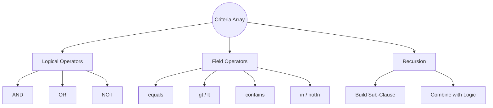
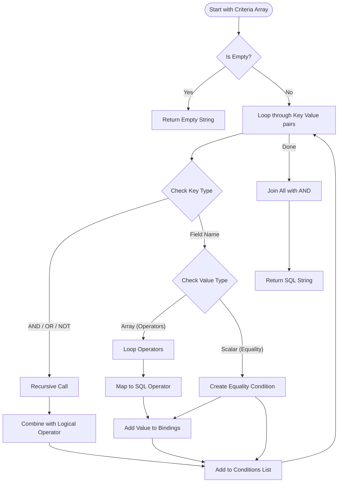

# Building a Recursive SQL Clause Builder (Prisma-style)

This guide explains how to implement a flexible, recursive SQL `WHERE` clause builder in PHP, similar to how Prisma ORM works. This allows you to build complex database queries using structured arrays.

## 🧠 The Concept (Mind Map)

The core idea is to treat the criteria array as a tree structure that we traverse recursively.



## 1. The Data Structure

We want to transform a PHP array into a SQL string.

### Simple Equality (Implicit AND)

```php
// PHP Input
[
    'username' => 'john',
    'age' => 25
]

// SQL Output
"username = ? AND age = ?"
```

### Logical Operators

```php
// PHP Input
[
    'OR' => [
        ['role' => 'admin'],
        ['role' => 'moderator']
    ]
]

// SQL Output
"(role = ?) OR (role = ?)"
```

### Comparison Operators

```php
// PHP Input
[
    'age' => ['gt' => 18]
]

// SQL Output
"age > ?"
```

## 2. Operator Mapping Table

We map specific array keys to SQL operators.

| Operator Key | SQL Operator | Example Input                         | Example SQL          |
| :----------- | :----------- | :------------------------------------ | :------------------- |
| `equals`     | `=`          | `['age' => ['equals' => 25]]`         | `age = 25`           |
| `not`        | `!=`         | `['status' => ['not' => 'banned']]`   | `status != 'banned'` |
| `gt`         | `>`          | `['price' => ['gt' => 100]]`          | `price > 100`        |
| `gte`        | `>=`         | `['price' => ['gte' => 100]]`         | `price >= 100`       |
| `lt`         | `<`          | `['count' => ['lt' => 10]]`           | `count < 10`         |
| `lte`        | `<=`         | `['count' => ['lte' => 10]]`          | `count <= 10`        |
| `contains`   | `LIKE`       | `['name' => ['contains' => 'foo']]`   | `name LIKE '%foo%'`  |
| `startsWith` | `LIKE`       | `['slug' => ['startsWith' => 'a-']]`  | `slug LIKE 'a-%'`    |
| `endsWith`   | `LIKE`       | `['email' => ['endsWith' => '.com']]` | `email LIKE '%.com'` |
| `in`         | `IN`         | `['id' => ['in' => [1, 2]]]`          | `id IN (?, ?)`       |

## 3. The Recursive Logic (Flowchart)

Here is how the `buildWhereClause` function processes the array:



## 4. Implementation Steps

### Step 1: Define the Function Signature

We need to pass the criteria array and a reference to `$bindings` (to collect values safely for prepared statements).

```php
function buildWhereClause(array $criteria, array &$bindings): string {
    // ...
}
```

### Step 2: Handle Logical Operators (Recursion)

If the key is `OR`, `AND`, or `NOT`, we must go deeper.

```php
if ($key === 'OR') {
    $subClauses = [];
    foreach ($value as $subCriteria) {
        // RECURSION: Call self
        $sql = buildWhereClause($subCriteria, $bindings);
        if ($sql) $subClauses[] = "($sql)";
    }
    return implode(' OR ', $subClauses);
}
```

### Step 3: Handle Field Operators

If the value is an array (like `['gt' => 18]`), we loop through it.

```php
if (is_array($value)) {
    foreach ($value as $operator => $operand) {
        switch ($operator) {
            case 'gt':
                $conditions[] = "$key > ?";
                $bindings[] = $operand;
                break;
            case 'contains':
                $conditions[] = "$key LIKE ?";
                $bindings[] = "%$operand%"; // Add wildcards
                break;
            // ... other cases
        }
    }
}
```

### Step 4: Handle Implicit Equality

If the value is simple (string/int), it's just equality.

```php
else {
    $conditions[] = "$key = ?";
    $bindings[] = $value;
}
```

## 5. Complete Code Example

Here is a simplified version of the logic:

```php
function buildWhereClause(array $criteria, array &$bindings): string {
    $conditions = [];

    foreach ($criteria as $key => $value) {
        // 1. Logical Operators
        if ($key === 'OR') {
            $parts = [];
            foreach ($value as $sub) {
                $parts[] = "(" . buildWhereClause($sub, $bindings) . ")";
            }
            $conditions[] = "(" . implode(" OR ", $parts) . ")";
            continue;
        }

        // 2. Field Operators
        if (is_array($value)) {
            foreach ($value as $op => $val) {
                if ($op === 'gt') {
                    $conditions[] = "$key > ?";
                    $bindings[] = $val;
                } elseif ($op === 'contains') {
                    $conditions[] = "$key LIKE ?";
                    $bindings[] = "%$val%";
                }
                // ... add others
            }
        }
        // 3. Implicit Equality
        else {
            $conditions[] = "$key = ?";
            $bindings[] = $value;
        }
    }

    return implode(" AND ", $conditions);
}
```

## 6. Why Use Bindings?

Notice we never put the value directly into the string:

- ❌ **Bad:** `"age > $val"` (Vulnerable to SQL Injection)
- ✅ **Good:** `"age > ?"` (Safe, value goes into `$bindings`)

The `$bindings` array is later passed to `$stmt->execute($bindings)`.

## Summary

- **Recursion** allows infinite nesting (`OR` inside `AND` inside `OR`).
- **Bindings** ensure security.
- **Mapping** translates friendly names (`contains`) to SQL (`LIKE`).
